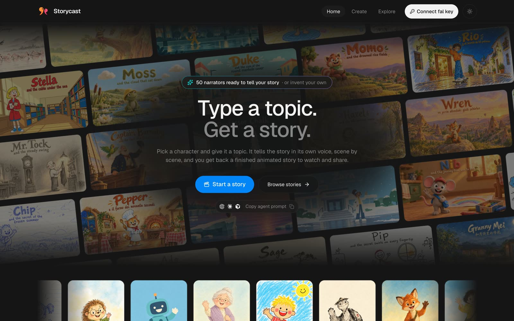
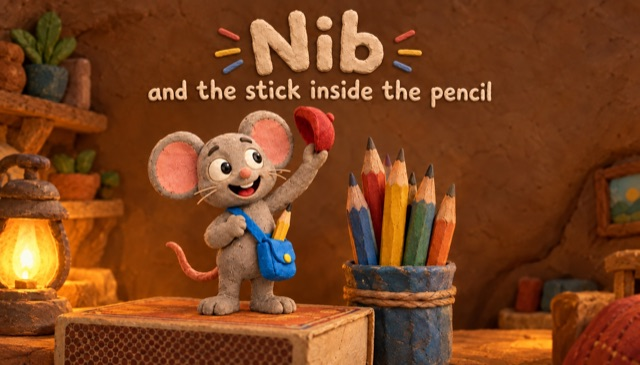
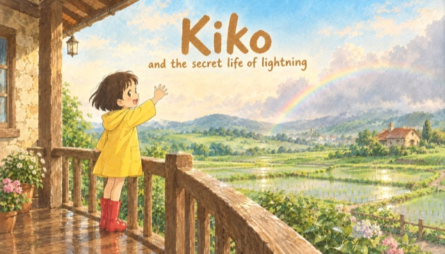
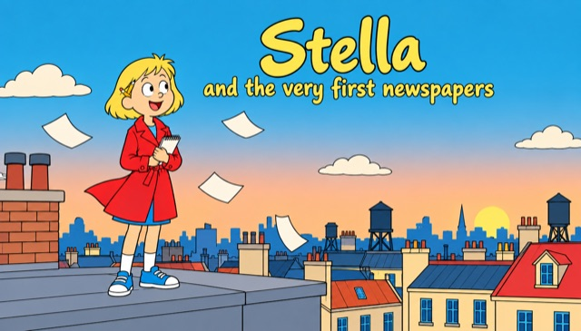
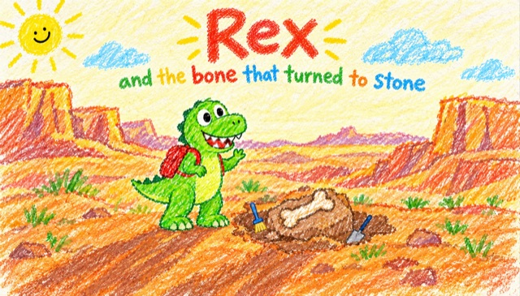
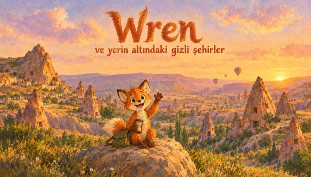
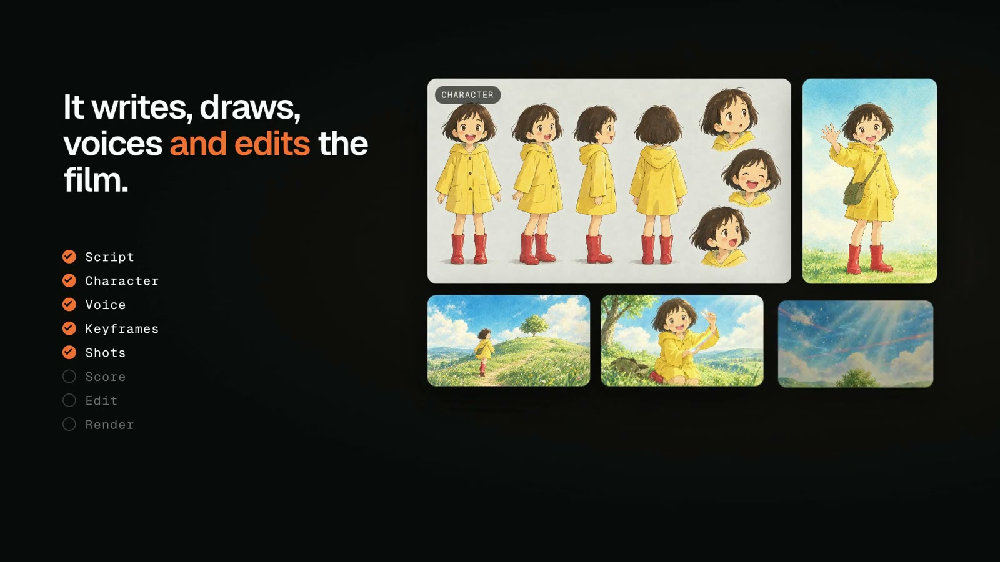
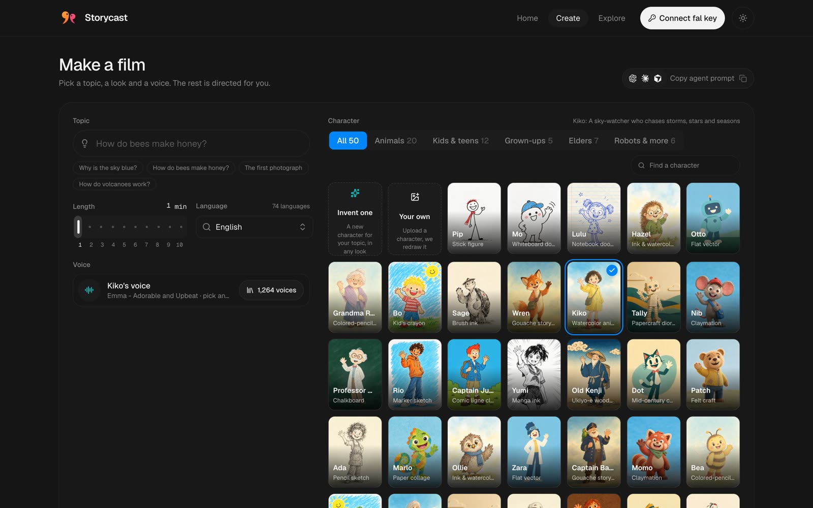
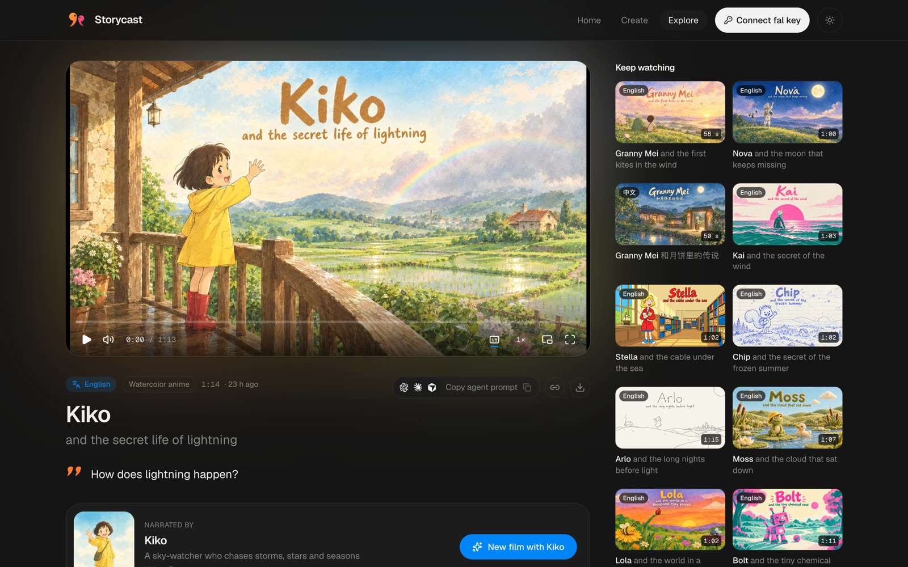
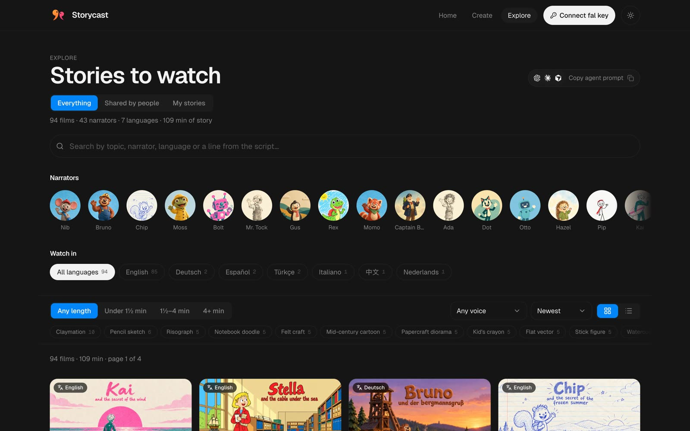

<p align="center">
  
</p>

<h1 align="center">Storycast</h1>

<p align="center">
  <b>Type a topic. Get a story.</b><br />
  Pick a character, give it a topic, and get back a narrated animated film, made end to end on <a href="https://fal.ai">fal</a>.
</p>

<p align="center">
  <a href="https://storycast-fawn.vercel.app"><b>Open Storycast</b></a> ·
  <a href=".github/assets/launch.mp4">Watch the launch video</a>
</p>

<p align="center">
  <a href="https://storycast-fawn.vercel.app"></a>
</p>

## What it makes

A character narrates a short film that explains a topic: a script, keyframes, animated shots, on-camera lines, narration,
a score, a hand-lettered end card and word-by-word subtitles. 50 ready narrators, 26 illustrated looks, 74 languages,
1 to 10 minutes long. You can also invent a character, upload your own, or bring your own illustration style.

<table>
  <tr>
    <td width="33%"><a href="https://storycast-fawn.vercel.app/films/10a4f1dd"></a><br /><sub><b>Nib</b> and the stick inside the pencil · Claymation</sub></td>
    <td width="33%"><a href="https://storycast-fawn.vercel.app/films/18d77a9d"></a><br /><sub><b>Kiko</b> and the secret life of lightning · Watercolor anime</sub></td>
    <td width="33%"><a href="https://storycast-fawn.vercel.app/films/2bf0760f"></a><br /><sub><b>Stella</b> and the very first newspapers · Comic ligne claire</sub></td>
  </tr>
  <tr>
    <td width="33%"><a href="https://storycast-fawn.vercel.app/films/0067bf73"></a><br /><sub><b>Rex</b> and the bone that turned to stone · Kid's crayon</sub></td>
    <td width="33%"><a href="https://storycast-fawn.vercel.app/films/19def244"></a><br /><sub><b>Rio</b> y el tango del puerto · Marker sketch · Español</sub></td>
    <td width="33%"><a href="https://storycast-fawn.vercel.app/films/1b1d5e2e"></a><br /><sub><b>Wren</b> ve yerin altındaki gizli şehirler · Gouache storybook · Türkçe</sub></td>
  </tr>
</table>

<p align="center">
  <a href=".github/assets/launch.mp4"></a><br />
  <sub>▶ Launch video</sub>
</p>

## How it works

Everything runs in your browser with your own fal key.

<table>
  <tr>
    <td></td>
    <td></td>
  </tr>
  <tr>
    <td align="center"><sub>Pick a topic, a narrator, a look, a voice and a length</sub></td>
    <td align="center"><sub>Watch, share or download the finished film</sub></td>
  </tr>
</table>

1. **Script.** A director writes the story in blocks, each either voice-over or the narrator talking on camera, and a
   script editor smooths every jump between scenes.
2. **Narrator and keyframes.** The narrator gets a model sheet and a hero portrait, and every block gets a keyframe in
   the chosen look.
3. **Voice.** Each block is narrated, and on-camera lines are fitted to the right length.
4. **Shots.** Voice-over blocks become animated shots and on-camera blocks become lip-synced shots.
5. **Score and edit.** A score is composed, the shots are cut to the narration, the sound is mixed, an end card is
   lettered and subtitles are added.

### Models

| Step | fal endpoint |
| --- | --- |
| Director, script editor | [`openrouter/router`](https://fal.ai/models/openrouter/router) with Claude Opus 5.5 |
| Reading images, shot checks | [`openrouter/router/vision`](https://fal.ai/models/openrouter/router/vision) with Claude Opus 5.5 and Gemini 3.8 Flash |
| Model sheets, keyframes, end cards | [`openai/gpt-image-2.5/flare/text-to-image`](https://fal.ai/models/openai/gpt-image-2.5/flare/text-to-image), [`openai/gpt-image-2.5/flare/edit`](https://fal.ai/models/openai/gpt-image-2.5/flare/edit) |
| Shots | [`minimax/h3-max/reference-to-video`](https://fal.ai/models/minimax/h3-max/reference-to-video) |
| On-camera lines | [`minimax/h3-max/lip-sync/image-to-video`](https://fal.ai/models/minimax/h3-max/lip-sync/image-to-video) |
| Narration | [`fal-ai/elevenlabs/tts/eleven-v3`](https://fal.ai/models/fal-ai/elevenlabs/tts/eleven-v3) |
| Score | [`elevenlabs/music/v2.5`](https://fal.ai/models/elevenlabs/music/v2.5) |
| Edit | [`fal-ai/workflow-utilities/trim-video`](https://fal.ai/models/fal-ai/workflow-utilities/trim-video) and `fal-ai/ffmpeg-api` (extract-frame, merge-videos, images-to-video, compose, loudnorm, merge-audio-video) |
| Subtitles | [`fal-ai/workflow-utilities/auto-subtitle`](https://fal.ai/models/fal-ai/workflow-utilities/auto-subtitle) |

### Make one with your agent

Every page has a **Copy agent prompt** button. It copies a step-by-step brief of this pipeline, filled in with the
page's topic, look, narrator and voice, so a coding agent with a fal key can make the film from your terminal.

<p align="center">
  
</p>

## Run locally

```bash
cd web && npm install && npm run dev
```

Connect your fal key in the app to make stories.

## Deploy

`web/` is a static Vite site. Deploy it to any static host (on Vercel: root `web/`).

### Sharing (optional)

`share/` is a Cloudflare Worker with D1 and R2. Without it, sharing is hidden.

```bash
cd share && npm install && npx wrangler login
npx wrangler d1 create storycast
npx wrangler r2 bucket create storycast-media
npx wrangler d1 execute storycast --remote --file schema.sql
npx wrangler turnstile widget create storycast-share --domain <your site host> --mode managed
```

Put the database id and your site's address (`ALLOWED_ORIGINS`) into `share/wrangler.jsonc`, then:

```bash
npx wrangler secret put IP_SALT
npx wrangler secret put TURNSTILE_SECRET
npx wrangler secret put FAL_KEY
npx wrangler deploy
```

Set `VITE_SHARE_API` and `VITE_TURNSTILE_SITE_KEY` for the site build (see `web/.env.example`) and redeploy.

To publish a story sent to Explore:

```bash
npx wrangler d1 execute storycast --remote --command "UPDATE films SET status = 'public' WHERE id = '<story id>'"
```
